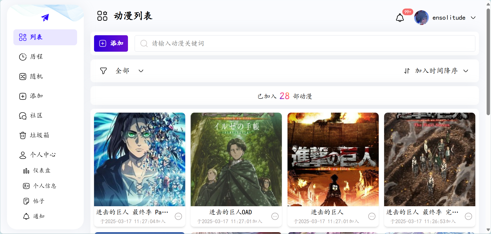
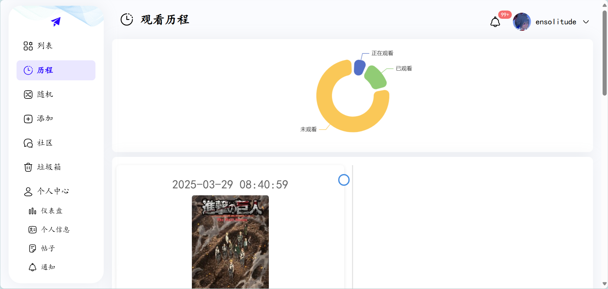
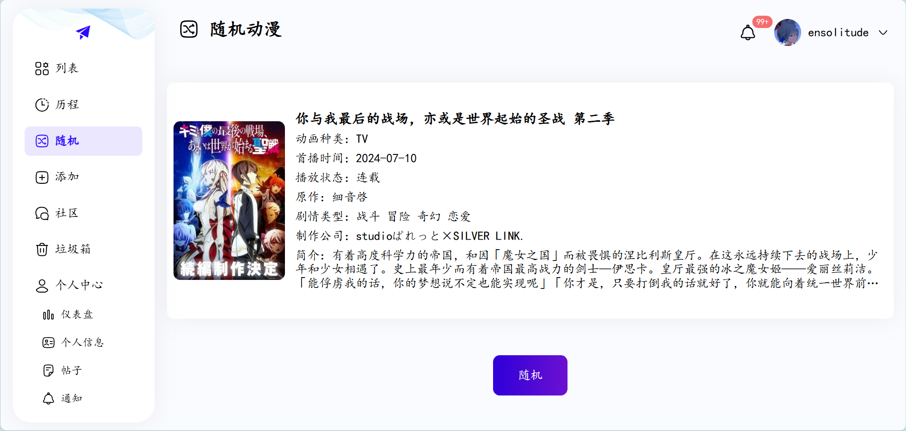
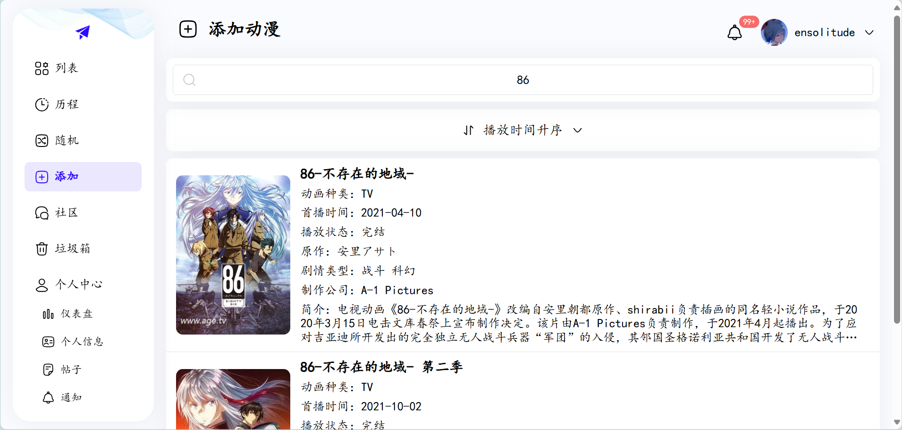
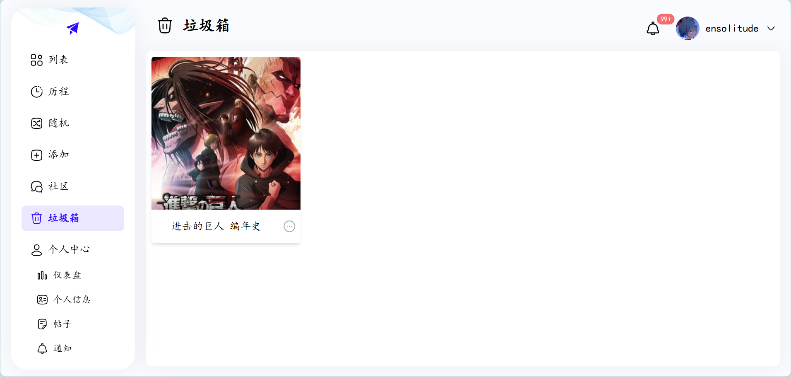
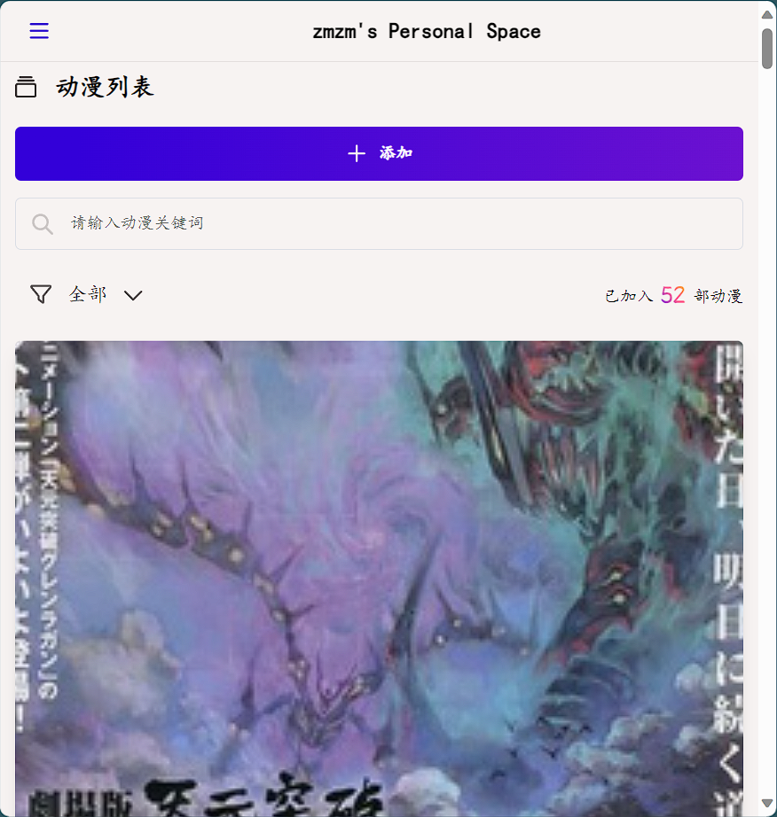

# 
Anime

一个你的动漫历程记录者

- [anime前台页面在这里](https://github.com/XXQJDR/anime)
- [anime后台页面在这里](https://github.com/XXQJDR/anime-admin)
- [anime后端在这里](https://github.com/XXQJDR/anime-api)
- [线上地址在这里](http://47.108.90.243/)

# 🎈 简介

作为一个二次元爱好者，在写这个项目之前，我遇到许多麻烦

- 记录：太多动漫要看，因此我利用电子记事本记录要看的动画名字，但是这种方式需要手动的将动漫名字从未看的位置剪切到已看的位置
- 遗忘：曾经动漫中那一幕幕打动内心的瞬间、曾经牵引你情绪的动漫，在当时无论你对它们印象多么深刻，都会随时间慢慢淡漠
- 选择：如何从要看的众多动漫里选出一个动漫

而这个项目能够很好的解决上面的问题，它能够添加动漫并以图片和文字的方式展示出来；能够将动漫标记为已看和未看；能够从为看的动漫里随机一个动漫；以时间线的方式展示你已看的动漫；能够上传图片，将那一幕幕打动内心的瞬间保存下来。

# ✨ 功能

- 👻 添加：添加一些你想要看的动漫
- 🐲 列表：列表中以图片加文字的方式展示你添加的动漫
- 🚗 历程；以时间线的方式展示已看动漫
- 🎈 随机：选择困难症选手狂喜
- 🛫 垃圾箱：支持删除添加的动漫
- 🦴 图片：支持上传图片，以瀑布流的方式展示图片
- 😶‍🌫️ 移动端：支持移动端

# ❣️ 截图

